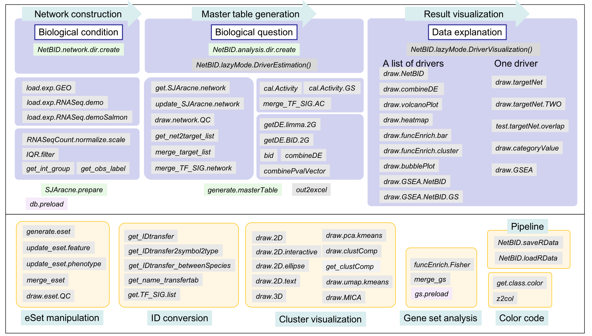

## User guide

### Design manual

The manual of all the NetBID functions is linked here [NetBID_manual.pdf](https://github.com/jyyulab/NetBID-dev/blob/master/NetBID_manual.pdf). 
Every function has its own demo scripts to demonstrate its functionality.

All these 70 functions can be grouped into their corresponding function modules,

**Here are 4 functions we think are ESSENTIAL for the NetBID pipeline management:**

- `NetBID.network.dir.create()` helps users to create an organized working directory for the network reconstruction step in NetBID analysis. It creates a hierarchcial working directory and returns a list containing this directory information. 

- `NetBID.analysis.dir.create()`  helps users to create an organized working directory for the driver inference step in NetBID analysis. It also creates a hierarchcial working directory and returns a list contains this directory information.

- `NetBID.saveRData()` helps users to save complicated list object generated by certain steps of NetBID’s pipeline. This function makes an easier data/pipeline management and reference.

- `NetBID.loadRData()` pairs with `NetBID.saveRData()`, it reloads previous saved Rdata, so users don't need to re-run everything.

**Here are 2 list objects we think are ESSENTIAL for the NetBID pipeline analysis:**

- `network.par` is a variable in the **network reconstruction part**. It is created by `NetBID.network.dir.create()` with network reconstruction directory information wrapped inside. This list object is used to store all the important results from the network reconstruction pipeline. It can be saved as RData and reloaded back using `NetBID.saveRData()` and  `NetBID.loadRData()`.
- `analysis.par` is a variable in the **driver analysis part**. It is created by `NetBID.analysis.dir.create()` with driver inference directory information wrapped inside. This list object is used to store all the important results from the driver inference pipeline. It also can be saved as RData and reloaded back using `NetBID.saveRData()` and  `NetBID.loadRData()`.

The workflow of each NetBID pipeline is summarized in the figure below,

**We highly suggest new users to follow the pipeline for driver analysis and visualization.** Details of the NetBID pipeline is shown and explained using a demo dataset in the following tutorial.
Of course, most functions in NetBID are still flexible to use and perform specific needs for users.

## Tutorial
 
We choose the demo dataset from GEO database: [GSE116028](https://www.ncbi.nlm.nih.gov/geo/query/acc.cgi?acc=GSE116028). 

This microarray dataset contains 13 adult medulloblastoma (MB) samples. 
Three phenotype subgroups of adult MB have been identified from distinguishabled expression profiles, clinical features, pathological features and prognosis.
These subgroups together with their sample numbers are, 3 SHH, 4 WNT, and 6 Group4.
Group4 tumors in adult have significantly worse progression-free and overall survival, compared to other molecular subtypes of tumor.
Here, the goal is to **find potential drivers in Group4 compared to other subtypes using NetBID**. This may relate to specific clinical feature of Group4 MB subtype.
 
**Though the dataset in the tutorial is microarray, NetBID is also capable to analyze RNA-Seq data. We will show in the tutorial below as well.**  
 
The tutorial contains three main parts, they can be followed by order or used independently:

1. [Network reconstruction](../docs/network_reconstruction)

2. [Driver inference (master table generation)](../docs/driver_inference)

3. [Advanced analysis (result visualization)](../docs/advanced_analysis)

